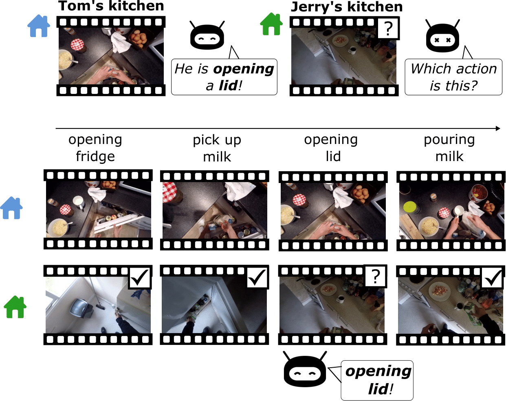
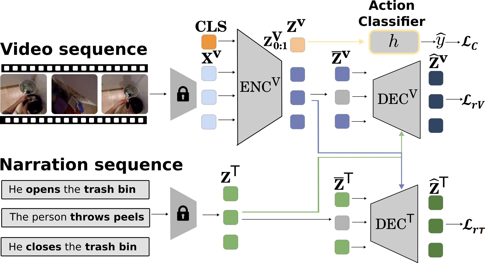

# Domain Generalization using Action Sequences for Egocentric Action Recognition
### [Politecnico di Torino](https://www.polito.it/)
### [The Visual And Multimodal Applied Learning Laboratory](https://vandal.polito.it/)
**Contributors**  
[Amirshayan Nasirimajd](https://ashayan97.github.io/),  [Chiara Plizzari](https://chiaraplizz.github.io/),   [Simone Alberto Peirone](https://sapeirone.github.io/), [Marco Ciccone](https://marcociccone.github.io/),   [Giuseppe Averta](https://www.linkedin.com/in/giuseppe-averta-b8b21788/),    [Barbara Caputo](https://vandal.polito.it/index.php/people/index.php/people/barbaracaputo/)  


 <!-- Replace with actual image path after uploading -->

## Abstract

Recognizing human activities from visual inputs, particularly through a first-person viewpoint, is essential for enabling robots to replicate human behavior. Egocentric vision, characterized by cameras worn by observers, captures diverse changes in illumination, viewpoint, and environment. This variability leads to a notable drop in the performance of Egocentric Action Recognition models when tested in environments not seen during training. 

In this paper, we tackle these challenges by proposing a **domain generalization approach** for Egocentric Action Recognition. Our insight is that action sequences often reflect consistent user intent across visual domains. By leveraging action sequences, we aim to enhance the model’s generalization ability across unseen environments.

Our proposed method, named **SeqDG**, introduces:
- A **visual-text sequence reconstruction objective** (**SeqRec**) that uses contextual cues from both text and visual inputs to reconstruct the central action of the sequence.
- A **domain mixing strategy** (**SeqMix**) to enhance robustness by training on mixed action sequences from different domains.

We validate SeqDG on the **EGTEA** and **EPIC-KITCHENS-100** datasets.  
**Results**:
- On **EPIC-KITCHENS-100**, SeqDG leads to **+2.4%** relative average improvement in cross-domain action recognition in unseen environments.
- On **EGTEA**, SeqDG achieves **+0.6% Top-1 accuracy** over the SOTA in intra-domain action recognition.

---
## Architecture

 <!-- Replace with actual image path after uploading -->

SeqDG is a domain generalization framework for egocentric action recognition that leverages the consistency of action sequences across different environments. The model takes both visual inputs (video clips) and textual narrations (e.g., verb-noun pairs) for a sequence of actions surrounding a central action. Visual features are encoded using a transformer encoder with a classification token, while textual features are extracted using a pre-trained language model. The central action in the sequence is masked in both modalities, and two separate decoders with cross-modal attention reconstruct the missing visual and textual information — a process that encourages the model to capture temporal and semantic dependencies across the sequence. Additionally, SeqDG includes a sequence-mixing augmentation strategy (SeqMix), where actions with the same label but from different domains are combined to improve robustness to domain shifts. The final action classification is performed using the CLS token from the visual encoder, and the model is jointly trained with classification and reconstruction losses. During inference, only visual inputs are used.

--- 

## Data

In this work, we used pre-trained features extracted from different backbones. In the table below, you can download and use the extracted features that were used to train this model.


| Dataset                                                              | Backbone                                                | Link                                                                |
|----------------------------------------------------------------------|---------------------------------------------------------|---------------------------------------------------------------------|
| [EPIC-KITCHENS-100 Dataset](https://epic-kitchens.github.io/2020)    | [TSN-TRN](https://arxiv.org/abs/1608.00859)             |[GoogleDrive](https://drive.google.com/drive/folders/1fjdedyTsKmMx2KWtLGM9SJxOm3GwvSwq?usp=drive_link)    |
| [EPIC-KITCHENS-100 Dataset](https://epic-kitchens.github.io/2020)    | [I3D-TRN](https://arxiv.org/abs/1705.07750)             |[GoogleDrive](https://drive.google.com/drive/folders/1g-Qsfx9X2n9Ma6g7f18o3UpxFPebjpjK?usp=drive_link)    |
| [EPIC-KITCHENS-100 Dataset](https://epic-kitchens.github.io/2020)    | [TSM-TRN](https://ieeexplore.ieee.org/document/9008827) |[GoogleDrive](https://drive.google.com/drive/folders/1Uxzndxf6tITf0z6wskP14HvlXGFK2gO6?usp=drive_link)    |
| [EPIC-KITCHENS-100 Dataset](https://epic-kitchens.github.io/2020)    | [TBN-TRN](https://arxiv.org/abs/1908.08498)             |[GoogleDrive](https://drive.google.com/drive/folders/1-2JFB1-OpikRU7WjziR8HjhmU4bg0YcS?usp=drive_link)    |
| [EGTEA Dataset](https://cbs.ic.gatech.edu/egtea/)                    | [SlowFast-TRN](https://arxiv.org/abs/1812.03982)        | ⚠️ To be Uploaded                   |

For text we used the extracted features from the BERT model, you can download the features from here ([GoogleDrive](https://drive.google.com/drive/folders/1m9SdJqKy_xgRz3Q1cCpvRa8gVvbfuQAT?usp=drive_link)).

You can download the annotation for EPIC-KITCHENs-100 from [here](https://github.com/epic-kitchens/epic-kitchens-100-annotations).

---

## Training

Download the data and annotation regarding each dataset and use the following code to train the model. 

```
python3 pipeline.py \
  --train_data <path to training data (source domain)> \
  --val_data <path to validation data (target/source domain validation)> \
  --train_labels <path to training data annotation> \
  --val_labels <path to validation data annotation> \
  --feature_path <path to pre-extracted text features> \
  --batch-size <batch size> \
  --num_layers 4 \
  --lr <learning rate> \
  --optimizer <optimizer type (adam/sgd)> \
  --epochs <number of epochs> \
  --lr_steps <lr decay steps list > \
  --output_dir <output directory> \
  -j <num data loading workers> \
  --classification_mode summary \
  --clip_number <clips availabe per action video based on the backbone> \
  --visual_input_dim <visual feature dimension> \
  --seg_number <number of clips to use for training> \
  --dropout <dropout rate> \
  --cuda_core <gpu id> \
  --running_name <experiment name for wandb> \
  --mix_up \
  --swapping < SeqMix use>\
  --modalities <list of using modality eg. rgb flow audio > \
  --seq_len <sequence length> \
  --disable_wandb_log <to disable wandb if you want>
```

---


## Citation

If you use this code or ideas from the paper, please cite our work:


---

## ⚠️ Warning

This repository is still under development.  
The code is **not yet cleaned**, and final components are subject to change.

---